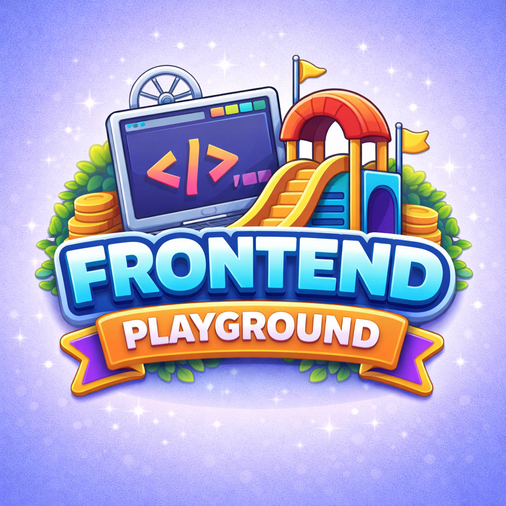

<p align="center">
  
</p>

# Yitong's Frontend Playground

This is a learning-oriented collection of frontend interactive mini projects.  
Rather than a loose set of demos, it is designed as a **searchable, tag-driven learning library** that helps users understand *what* they are learning and *why* each project exists.

Each project focuses on a specific set of knowledge points and is presented with a preview before entry, making the repository suitable for:

- Structured self-study and skill reinforcement
- Reviewing and revisiting specific frontend or interaction concepts
- Building a portfolio that demonstrates learning depth, not just final results

---

## ✨ Key Features

### 🧩 Project Preview Before Entry
Clicking a project on the homepage opens a preview window instead of navigating immediately.  
Each preview shows:

- Project screenshot
- Short description
- Covered knowledge points
- Clear actions: **Enter Project** or **Cancel**

This helps users decide whether the project fits their current learning goals.

### 🏷 Knowledge-Based Tag System
Every project is labeled with explicit learning tags, such as:

- DOM manipulation
- Fetch API / Promises
- Event handling
- Game logic and state management
- UI / UX interaction patterns

Tags are used consistently across the entire project library.

### 🔎 Search & Filter for Learning
Projects can be filtered by:

- Category (e.g. Mini Games, Frontend Basics, Tools, Engine Experiments)
- One or multiple knowledge tags
- Keyword search (title, description, or tags)

This allows users to quickly locate projects related to a specific topic they want to practice.

### 📈 Tutorial → Enhanced Projects
Many projects start from tutorials or basic examples, but are intentionally upgraded by:

- Cleaning and organizing code structure
- Adding clear comments and explanations
- Improving UI and visual presentation
- Introducing extra features or better interaction

The goal is to demonstrate **understanding and iteration**, not just tutorial completion.

---

## 📁 Project Structure (Example)

```text
FrontendPlayground/
│
├─ FrontendPlayground.html         # Main learning hub (homepage)
├─ FrontendPlayground.js           # Homepage logic (filtering, preview modal, recommendations)
├─ FrontendPlayground.css          # Homepage styles
├─ Projects.js                     # Lists of project groups and project data
├─ README.md (You are here)        # Instructions of this collection
│
├─ Projects/
│   ├─ English/                    # Project Group
│   │   ├─ HangmanGame/            # Project
│   │   │   ├─ HangmanGame.html    # Project Homepage
│   │   │   ├─ HangmanGame.js      # Project script
│   │   │   ├─ HangmanGame.css     # Project styles
│   │   │   └─ README.md           # Project description
│   │   └─ ...
│   ├─ MiniGames/
│   ├─ Simulation/
│   └─ ...
│
├─ Shared/                         # Components used by multiple projects
└─ UI/                             # Visual assets

```

---

## 🧠 What Information Does Each Project Include?
Each project is defined in Projects.js with structured metadata:
```text
{
  name: "Card Wars",
  url: "/Projects/MiniGames/CardWars/CardWars.html",
  tags: ["DOM", "Fetch API", "Promise", "Event Handling", "Third-Party API"],
  desc: "A card battle mini game using the Deck of Cards API to practice async requests and basic game logic.",
  logo: "/UI/Project_Logos/CardWars_Logo.png",
  thumbnail: "/UI/Project_Thumbnails/CardWars_Thumbnail.png",
  duration: "20-30 minutes"
}

```
This data powers:
- Homepage rendering
- Preview modal content
- Tag-based filtering
- Learning recommendations

---

## 🧭 How to Use This Repository
### Option 1: Learn by Knowledge Topic
1. Open the homepage
2. Select one or more tags (e.g. DOM, Promise)
3. Browse the filtered project list
4. Open a project preview to confirm relevance
5. Enter the project and explore the code

### Option 2: Time-Based Learning
Projects often include an estimated learning duration.
- Choose a project that fits your available time (e.g. 20–30 minutes)
- Focus on one clear goal:
  - Understand the main logic
  - Modify a variable or interaction
  - Add a small improvement

### Option 3: Advanced Practice (Recommended)
1. Run the project as-is
2. Read through the commented code
3. Try one or more of the following:
    - Refactor a function
    - Improve layout or styling
    - Add a new rule, state, or interaction
4. Compare your version with the original

---

## 📄 License
This project is intended for learning and portfolio demonstration purposes.
If you reuse or adapt any content, please provide attribution.